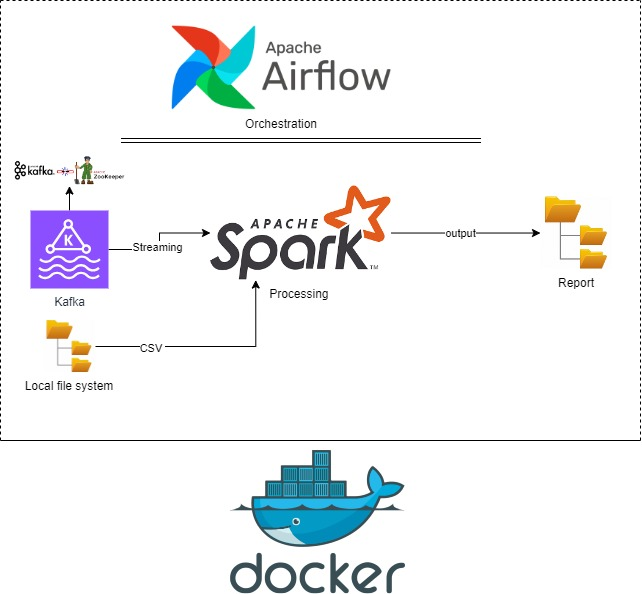

## Pipeline Architecture Overview

This pipeline consists of a streaming data process using Kafka, Spark, Docker, and Airflow for orchestration. The architecture is designed to stream data from Kafka, process it using Spark, and save the output as reports.
## Architecture



### Tools & Technologies:
- **Kafka**: For streaming data.
- **Spark**: For processing data.
- **Docker**: For containerized services.
- **Airflow**: For orchestration and job scheduling.
- **Local File System**: For reading input CSV files and writing output reports.
- **Kafka UI**: For monitoring Kafka topics.

---

## Steps to Run the Pipeline

### 1. Clone the GitHub Repository
Start by cloning the required repository:

```bash
git clone https://github.com/HassanAli-star/big_data_pipeline
```

### 2. Move to the Repo Folder
Navigate to the folder of the cloned repository:

```bash
cd big_data_pipeline
```

### 3. Run Docker Compose
Start all required services using Docker Compose:

```bash
docker-compose up
```

Wait for all services to start up. This includes Kafka, Spark, Airflow, and other services required by the pipeline.

### 4. Login into Airflow
Once all services are up, you can access Airflow via your browser. Go to:

```text
http://localhost:8080
```

Login to the Airflow UI to access the DAGs (Directed Acyclic Graphs) for orchestration.

### 5. Run the Spark Streaming Job
In the Airflow UI, run the DAG that triggers the Spark Streaming job:

- Navigate to **DAGs**.
- Search for `report_generator`.
- Trigger the DAG to start the Spark Streaming job that processes data.

### 6. Run the Kafka Producer Job
After running the Spark Streaming job, run the Kafka producer job to generate the streaming data:

- In Airflow, search for the DAG named `kafka-producer`.
- Trigger the DAG to start the Kafka producer job.
  
This will start sending view log data to the Kafka topic.

### 7. Monitor Kafka Topics
You can monitor the Kafka topics by logging into the Kafka UI:

```text
http://localhost:8089
```

- Check the Kafka topic `view_log` to ensure that the data is being generated and streamed.

### 8. Check the Report Folder for Output Files
Once the pipeline is running, the processed data will be saved as reports in a designated folder.

- Navigate to the `report` folder in the file system (or a mounted volume, depending on your setup).
- You should see Parquet files generated based on the processed data from Spark.

---

### Notes:
- Ensure that all services are up and running before triggering the jobs in Airflow.
- The Kafka UI can be used to debug and check the status of Kafka topics in real-time.

---

## Kafka Producer Details

- The Kafka producer is a Python script embedded inside an Airflow DAG that generates **view logs** and pushes them to a Kafka topic. This producer follows a specific schema as mentioned in the requirements:

  | Column Name      | Data Type   | Description                                           |
  |------------------|-------------|-------------------------------------------------------|
  | `view_id`        | STRING      | Unique ID of the view record                          |
  | `start_timestamp`| TIMESTAMP   | Timestamp when the view started                       |
  | `end_timestamp`  | TIMESTAMP   | Timestamp when the view ended (also when pushed to Kafka)|
  | `banner_id`      | BIGINT      | The ID of the banner being displayed                  |
  | `campaign_id`    | INT         | The campaign associated with the view                 |

- Each log is sent to the Kafka topic `view_log` using this schema. The logs represent user interactions with banners (views) and are simulated by this producer.

---

## Spark Streaming Job

- The Spark script reads view logs from the Kafka topic and processes the data in real-time. The key aspects of the Spark streaming job are:

  **Time Window for Reporting**: The logs are processed in 1-minute time windows.

- **Processing Logic**:
  - **Watermarking** is used to handle late data up to 10 seconds.
  - For each 1-minute window, the Spark job calculates:
    - `avg_duration`: The average view duration.
    - `total_count`: The total number of views.
  
- **Output**:
  - The processed data is written into **Parquet files** with the following schema:

    | Column Name        | Data Type | Description                                                |
    |--------------------|-----------|------------------------------------------------------------|
    | `campaign_id`       | INT       | The campaign ID from the view logs                         |
    | `network_id`        | INT       | Network ID associated with the campaign                    |
    | `minute_timestamp`  | TIMESTAMP | The start timestamp of the minute for the report window     |
    | `avg_duration`      | DOUBLE    | The average duration of views during the time window        |
    | `total_count`       | INT       | The total number of views in the time window                |

- The Parquet files are partitioned by `network_id` and `minute_timestamp` to facilitate easy querying and retrieval.

---

## Folder Structure

- The report files are saved in the `report` directory. Files are partitioned based on:
  - `network_id`: The network identifier for the campaign.
  - `minute_timestamp`: The starting timestamp for the 1-minute time window.

---
